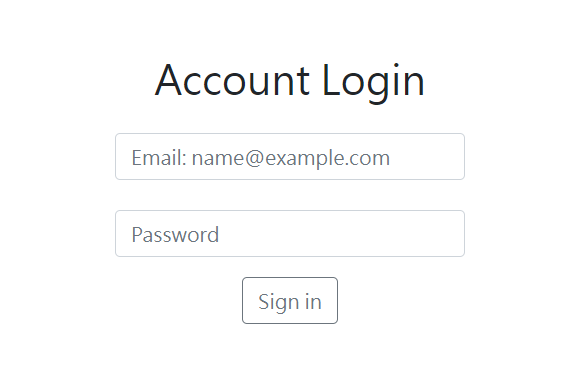

# User Authentication

<br>
:sparkles: A simple version of the Login Page.

## Features
* Enter account and password to login

## Installation
* Install the Node.js and npm according to your OS(MacOS or Windows).
* Download the project to your local machine.
* Get into your project folder by Terminal and enter
  ```bash
  npm install
  ```

## How to use
* Get start by enter
  ```bash
  npm run dev
  ```
  It's running when you see
  ```bash
  App is running on http://localhost:3000
  ```
* Open the browser, and enter the URL `http://localhost:3000`
* You can stop on Terminal by
  ```bash
  Ctrl + C
  ```

## Build with
* Node.js @14.16.0
* Express.js @4.17.1
* express-handlebars @4.0.6
* Bootstrap @5.1.3